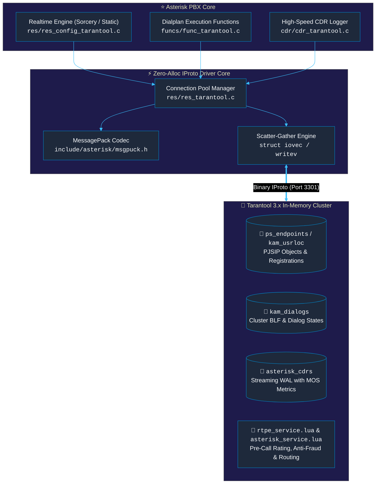

# Asterisk Tarantool 3.x Native Connector Suite

High-performance, carrier-grade Tarantool 3.x in-memory database connector suite for **Asterisk PBX 20 LTS, 22 LTS, and master**.



---

## 🌟 Superpowers & Architectural Advantages

1. **Sub-100 Microsecond PJSIP Realtime Lookups:**
   * Replaces slow synchronous MySQL/ODBC queries with direct in-memory Slab lookups ($O(\log N)$ or $O(1)$) over binary IProto protocol.
2. **Unified Pre-Paid Rating & Anti-Fraud in Dialplan:**
   * Execute `${TARANTOOL(tnt1, call_authorize, ${CALLERID(num)}, ${EXTEN})}` directly in `extensions.conf` in **< 0.2 ms** without FastAGI process spawn overhead.
3. **High-Speed Streaming WAL CDR Logging (100k+ ops/sec):**
   * Non-blocking binary CDR persistence with zero SQLite3/ODBC database lock contention.
4. **Shared Multi-Stack Location & State:**
   * Asterisk seamlessly reads subscriber locations registered at **Kamailio** / **OpenSIPS** (`kam_usrloc`) from the shared Tarantool cluster.

---

## 📁 Module Inventory

| Module | Location | Description |
|---|---|---|
| **`res_tarantool.c`** | `res/` | Core IProto connection pool, TCP keepalive, auto-reconnect, and CLI commands |
| **`res_config_tarantool.c`** | `res/` | Asterisk Realtime engine supporting Sorcery, dynamic lookups, and static `.conf` |
| **`func_tarantool.c`** | `funcs/` | Dialplan functions `${TARANTOOL(...)}` and `${TARANTOOL_EVAL(...)}` |
| **`cdr_tarantool.c`** | `cdr/` | High-volume non-blocking CDR logging backend |
| **`msgpuck.h`** | `include/asterisk/` | Lightweight zero-dependency MessagePack encoder/decoder header |
| **`tarantool.conf.sample`** | `configs/` | Connection profile and pool configuration sample |
| **`cdr_tarantool.conf.sample`** | `configs/` | CDR engine configuration sample |

---

## 🔧 Sample Configuration

### `/etc/asterisk/tarantool.conf`
```ini
[general]

[tnt1]
host = 127.0.0.1
port = 3301
user = asterisk
secret = secret123
pool_size = 8
timeout_ms = 500
```

### `/etc/asterisk/extconfig.conf`
```ini
[settings]
ps_endpoints => tarantool,tnt1,ps_endpoints
ps_auths     => tarantool,tnt1,ps_auths
ps_aors      => tarantool,tnt1,ps_aors
extensions   => tarantool,tnt1,extensions
```

### `/etc/asterisk/extensions.conf`
```ini
[from-internal]
; Real-time pre-call rating & authorization (< 0.2 ms)
exten => _+X.,1,Set(AUTH=${TARANTOOL(tnt1,call_authorize,${CALLERID(num)},${EXTEN})})
same => n,GotoIf($["${AUTH}" != "OK"]?rejected)
same => n,Dial(PJSIP/${EXTEN},30)
same => n,Hangup()

same => n(rejected),Playback(prepaid-no-funds)
same => n,Hangup()
```
