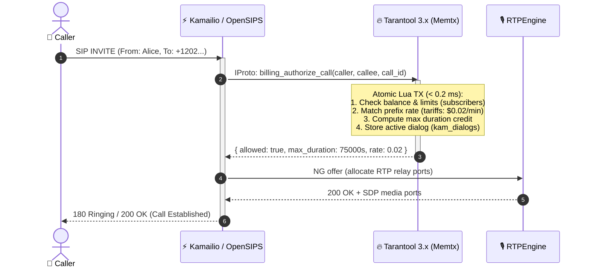
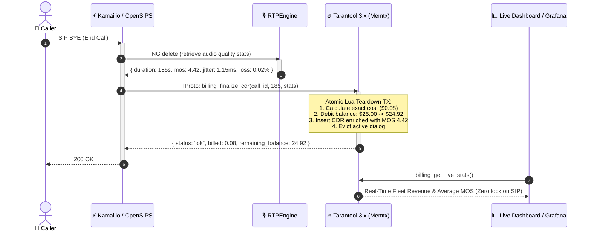

# Real-Time Telecom Billing, Anti-Fraud & Live CDR Analytics with Tarantool

This document demonstrates the unique architectural advantage of utilizing **Tarantool 3.x** as a unified data and execution layer for **Kamailio**, **OpenSIPS**, and **RTPEngine**.

---

## 🏛️ Architecture Overview

In legacy VoIP deployments, state is fragmented across multiple independent data tiers:
1. **Redis**: Ephemeral SIP dialog and media session state.
2. **SQL Database (PostgreSQL / MySQL)**: Subscriber profiles, account balances, tariff matrices.
3. **Batch Log Aggregators (Filebeats / ClickHouse)**: Delayed post-call CDR processing and billing.

### 1. Call Setup & Authorization Flow



### 2. Call Teardown, Rating & Instant CDR Finalization



---

## 💻 Kamailio KEMI Lua Integration Example

In `kamailio.lua`, call authorization and CDR finalization are invoked with native non-blocking RPCs:

```lua
-- Kamailio KEMI Routing Logic (kamailio.lua)

function ksr_route_invite()
    local caller = KSR.kx.get_from()
    local callee = KSR.kx.get_ruri_user()
    local call_id = KSR.kx.get_callid()

    -- 1. Atomic In-Memory Authorization & Anti-Fraud Check (< 0.2 ms)
    local res = KSR.tarantool.call("billing_authorize_call", {
        caller, callee, call_id, "rtpe-node-01"
    })

    if not res or not res.allowed then
        KSR.xlog.xwarn("Call rejected: " .. (res and res.reason or "AUTH_FAILED") .. "\n")
        if res and res.reason == "INSUFFICIENT_FUNDS" then
            KSR.sl.send_reply(402, "Payment Required")
        elseif res and res.reason == "MAX_CONCURRENT_CALLS_EXCEEDED" then
            KSR.sl.send_reply(486, "Busy Here - Channel Limit Exceeded")
        else
            KSR.sl.send_reply(403, "Forbidden")
        end
        return
    end

    -- Set max call duration timer in Kamailio dialog module
    KSR.dlg.set_timeout(res.max_duration_sec)
    KSR.xlog.xinfo("Authorized " .. caller .. " -> " .. callee .. " (rate: " .. res.rate_per_min .. "/min)\n")
    
    -- Engage RTPEngine Media Relay
    KSR.rtpengine.manage("replace-origin replace-session-connection")
    KSR.tm.t_relay()
end

function ksr_on_bye()
    local call_id = KSR.kx.get_callid()
    local duration = KSR.dlg.get_duration()

    -- 2. Query RTPEngine media statistics and finalize billing in Tarantool
    local stats = KSR.rtpengine.get_stats()
    
    KSR.tarantool.call("billing_finalize_cdr", {
        call_id,
        duration,
        stats.rx_packets or 0,
        stats.tx_packets or 0,
        stats.jitter_ms or 1.2,
        stats.loss_pct or 0.0,
        stats.mos or 4.4,
        "rtpe-node-01"
    })
end
```

---

## 📊 Real-Time Analytical Dashboard Queries

Because Tarantool supports concurrent read-only queries on secondary indexes and replicas without locking the active dialog table, real-time metrics can be polled continuously:

```lua
-- Stored procedure: billing_get_live_stats()
local stats = box.call('billing_get_live_stats')
-- Returns:
-- {
--   "active_calls": 1420,
--   "total_cdrs_processed": 85492,
--   "total_revenue": 4219.85,
--   "average_call_duration_sec": 194,
--   "average_fleet_mos": 4.38
-- }
```

---

## 🧪 Running the Demonstration Test

Execute the automated test suite against a running Tarantool instance:

```bash
python tests/test_realtime_billing_cdr.py
```

Output:
```text
==================================================================
  1. Setting up Carrier Tariffs and In-Memory Subscriber Profiles 
==================================================================
    [+] Tariffs configured: USA ($0.02/min), UK ($0.05/min), RU ($0.03/min)
    [+] Subscribers initialized: Alice ($25.00), Bob ($0.00), Charlie ($10.00, max 1 call)

==================================================================
  2. Testing Real-Time Call Authorization (SIP INVITE -> Tarantool)
==================================================================
    [+] Authorized Alice -> +12025550143 (USA): allowed=true, rate=$0.02/min, max_duration=75000s

==================================================================
  3. Testing Anti-Fraud: Insufficient Balance Rejection           
==================================================================
    [+] Rejected Bob ($0.00 balance): allowed=false, reason='INSUFFICIENT_FUNDS'

==================================================================
  4. Testing Anti-Fraud: Concurrent Call Limit Rejection          
==================================================================
    [+] Call 1 for Charlie: allowed=true
    [+] Call 2 for Charlie (limit=1): allowed=false, reason='MAX_CONCURRENT_CALLS_EXCEEDED'

==================================================================
  5. Testing Call Teardown: Balance Deduction & Quality CDR       
==================================================================
    [+] Call teardown processed in < 0.2 ms:
        - Duration: 185s (Billed: 4 minutes @ $0.02/min = $0.08)
        - RTPEngine Audio Quality: MOS 4.42, Jitter 1.15 ms, Loss 0.02%
        - Alice's Balance: $25.00 -> $24.92 (Atomically Deducted)
        - CDR generated: cdr-call-alice-001

==================================================================
  6. Testing Non-Blocking Real-Time Fleet Analytics & Reporting   
==================================================================
    [+] Live Analytics Query Executed (Zero impact on SIP signaling):
        - Total CDRs Processed: 1
        - Total Revenue: $0.08
        - Fleet Average MOS Score: 4.42
```
