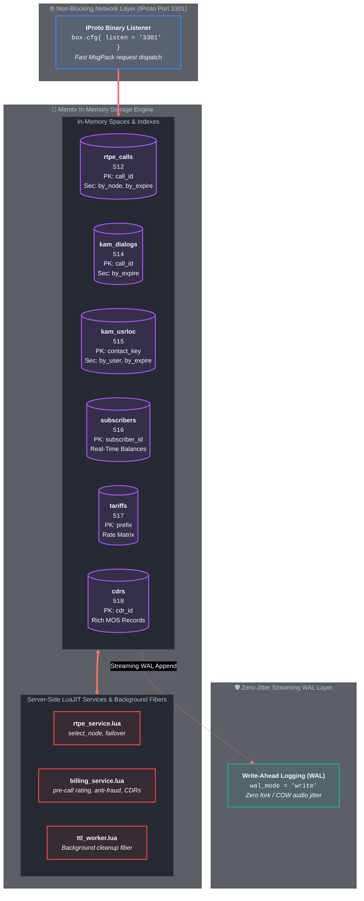

# Tarantool 3.x VoIP Backend (`tarantool_backend`)

High-performance, transactional in-memory backend application for **RTPEngine**, **Kamailio**, and **OpenSIPS** built on **Tarantool 3.x**.

---

## 🏗️ Backend Architecture



---

## 🚀 Quick Deployment & Installation Guide

There are three ways to deploy and run the Tarantool VoIP Backend:

### Option 1: Docker / Docker Compose (Instant 1-Command Startup)

```bash
# Clone the repository
git clone https://github.com/lean1ee/tarantool-voip-backend.git
cd tarantool-voip-backend

# Start Tarantool backend in background
docker compose up -d tarantool
```

Or run standalone container directly:
```bash
docker run -d --name tarantool-voip \
  -p 3301:3301 \
  -v $(pwd)/tarantool_backend:/opt/tarantool \
  lean1ee/tarantool:3.8 \
  tarantool /opt/tarantool/init.lua
```

---

### Option 2: Standalone Linux Host / Systemd Service

1. **Install Tarantool 3.x (Debian/Ubuntu):**
```bash
curl -s https://download.tarantool.org/tarantool/release/3/installer.sh | bash
apt-get install -y tarantool
```

2. **Deploy VoIP Application:**
```bash
mkdir -p /etc/tarantool/instances.available/voip /var/lib/tarantool/voip
cp -r tarantool_backend/* /etc/tarantool/instances.available/voip/
ln -s /etc/tarantool/instances.available/voip /etc/tarantool/instances.enabled/voip

# Start systemd service
systemctl daemon-reload
systemctl enable --now tarantool@voip
```

---

### Option 3: Integrate Schema into an Existing Tarantool Cluster

If you already run a production Tarantool cluster (or Tarantool Cartridge), simply require and initialize the schema inside your existing instance `init.lua`:

```lua
-- In your Tarantool application entry point:
local schema = require('app.schema')
local rtpe_service = require('app.rtpe_service')
local ttl_worker = require('app.ttl_worker')

-- 1. Initialize VoIP Memtx spaces and secondary indexes
schema.init()

-- 2. Export global RPC stored procedures for IProto clients
rawset(_G, 'rtpe_call_upsert', rtpe_service.call_upsert)
rawset(_G, 'rtpe_call_delete', rtpe_service.call_delete)
rawset(_G, 'rtpe_call_get', rtpe_service.call_get)
rawset(_G, 'rtpe_call_restore', rtpe_service.call_restore)
rawset(_G, 'rtpe_select_node', rtpe_service.select_optimal_node)

-- 3. Start non-blocking continuous TTL cleanup fiber
ttl_worker.start(5)
```

---

## 🗄️ In-Memory Space Schema Specification

### 1. `rtpe_calls` (Space ID: 512)
Stores active RTPEngine media sessions and call legs.

| Field Index | Field Name | Type | Description |
|:---|:---|:---|:---|
| 1 | `call_id` | `string` | SIP Call-ID (Primary Key) |
| 2 | `node_id` | `string` | RTPEngine node identifier (`rtpe-01`) |
| 3 | `state` | `string` | Session status (`active`, `closing`, `terminated`) |
| 4 | `created_at` | `unsigned` | Epoch timestamp of call initialization |
| 5 | `updated_at` | `unsigned` | Epoch timestamp of last SDP modification |
| 6 | `expires_at` | `unsigned` | Expiration deadline for TTL cleanup |
| 7 | `payload` | `string` / `map` | Bencoded/JSON SDP parameters, ports, codecs |

**Indexes:**
* `primary` (`TREE`): `[call_id]` — $O(\log N)$ point lookups by SIP Call-ID.
* `by_node` (`TREE`): `[node_id, updated_at]` — Enables instant $O(\log N)$ failover retrieval of all sessions belonging to a failed media node.
* `by_expire` (`TREE`): `[expires_at]` — Ordered index enabling non-blocking continuous TTL cleanup without full table scans.

---

### 2. `cluster_nodes` (Space ID: 513)
Tracks health, capacity, and active call count for all RTPEngine media nodes.

| Field Index | Field Name | Type | Description |
|:---|:---|:---|:---|
| 1 | `node_id` | `string` | Unique media node hostname or identifier |
| 2 | `address` | `string` | IPv4 / IPv6 address of RTPEngine daemon |
| 3 | `status` | `string` | Node availability (`active`, `draining`, `dead`) |
| 4 | `active_calls`| `unsigned` | Active stream count or CPU load index |
| 5 | `last_ping` | `unsigned` | Timestamp of last heartbeat |

---

### 3. `kam_dialogs` (Space ID: 514)
Stores active SIP dialogs synchronized across Kamailio and OpenSIPS proxies.

| Field Index | Field Name | Type | Description |
|:---|:---|:---|:---|
| 1 | `call_id` | `string` | SIP Call-ID (Primary Key) |
| 2 | `from_tag` | `string` | SIP From-tag |
| 3 | `to_tag` | `string` | SIP To-tag |
| 4 | `state` | `unsigned` | Dialog state enum |
| 5 | `expires_at` | `unsigned` | Expiration timestamp |
| 6 | `extra_data` | `any` | Optional routing attributes |

---

## ⚡ Stored Procedures (`app/rtpe_service.lua`)

* **`rtpe_call_upsert(call_id, node_id, payload, ttl_sec)`**: Atomically inserts or updates a call record, auto-calculating `expires_at = now + ttl`.
* **`rtpe_call_delete(call_id)`**: Atomically deletes the call tuple from `rtpe_calls` upon BYE / call teardown.
* **`rtpe_call_restore(dead_node_id)`**: Fetches all active sessions assigned to a failed node in a single $O(\log N)$ range scan (2 ms failover recovery).
* **`rtpe_select_node(call_id)`**: In-memory load-balancing heuristic that evaluates online candidate media nodes and returns the least-loaded node in **70 µs**.

---

## 🧹 Continuous Background TTL Fiber (`app/ttl_worker.lua`)

* Purges expired records in batches of 500–1000 tuples using index `by_expire`.
* Yields execution (`fiber.yield()`) between batches to prioritize client IProto transactions.
* Guarantees 0 transaction stalls and 0 memory residue.
